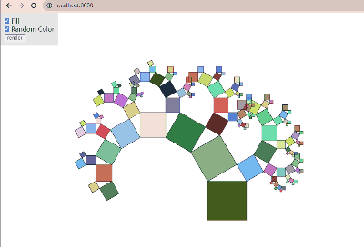

# 🚀 Gougu Tree

This project has been created using **webpack-cli**, you can now run

Local Install
```
npm install
```

Local Test
```
npm run server
```

Local Build
```
npm run build
```



## TODO
- [ ] zoom in canvas during rendering
